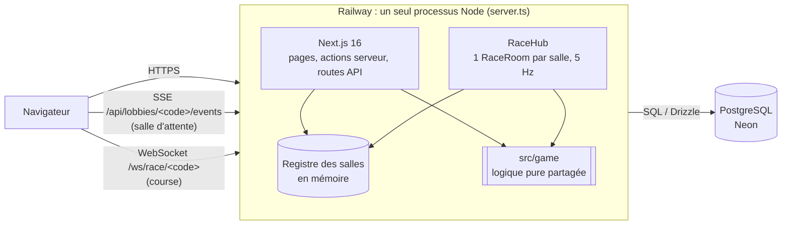
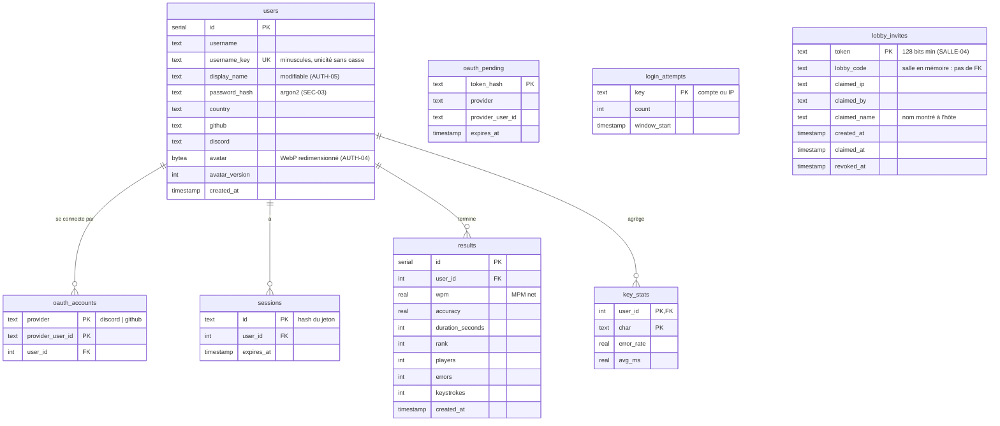
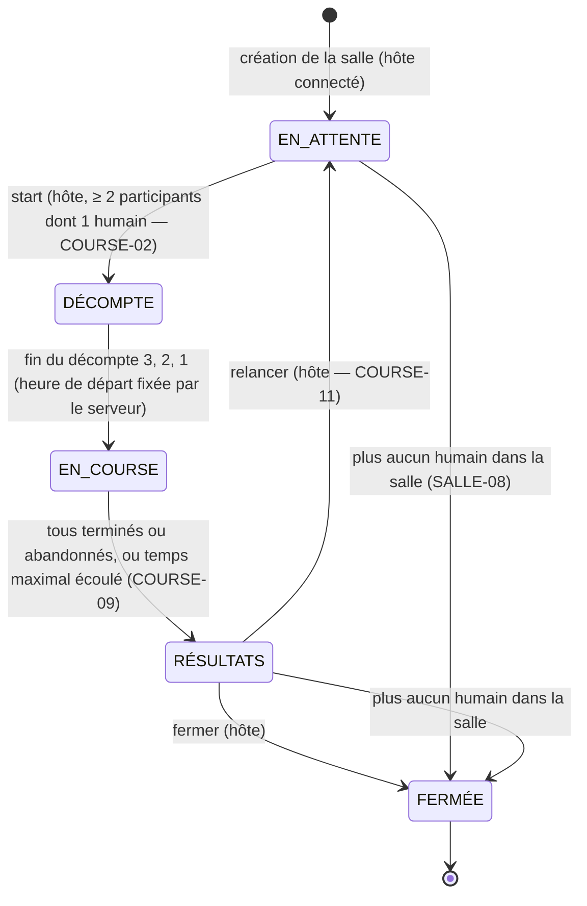

# Architecture — Curse Typer

Version initiale (checkpoint 1). Les identifiants d'exigences (TECH-06, COURSE-01…) renvoient à l'énoncé
`Web-V-Travail-de-session.pdf`. Le détail des règles de la course est dans [`RACE-LOOP.md`](RACE-LOOP.md).

## 1. Vue d'ensemble

- **Un seul processus** (`server.ts`) sert Next.js et accepte les WebSocket de course. Aucun service temps réel tiers.
- **État des salles en mémoire** (`src/lib/lobbies.ts`) : une salle vit le temps d'une session de jeu et change
  plusieurs fois par seconde. Seuls les comptes, les sessions, les résultats et les liens d'invitation vont en base.
- **Logique de jeu pure** dans `src/game/` (réducteurs `état + événement → nouvel état`, sans I/O), importée par le
  client pour l'affichage instantané et par la room pour la vérité serveur (COURSE-06). Testée sans mock.
- **Déploiement** : Railway (`railway.json`) construit avec `npm run build`, applique les migrations
  (`preDeployCommand: npm run db:migrate`), puis lance `npm start`. HTTPS fourni par Railway.
  Base PostgreSQL sur Neon (forfait gratuit, TECH-08).

## 2. Modèle de données

Tables actuelles (`src/db/schema.ts`, migrations versionnées dans `drizzle/`).

Aucune adresse courriel n'est stockée, même si le fournisseur OAuth en transmet une.
Les invités n'ont pas de ligne en base : leur session est un cookie signé (`src/lib/auth/guestCookie.ts`).

### Évolutions prévues pour la remise finale

| Table prévue | Rôle | Exigences |
|---|---|---|
| `races` | Une course jouée : code de salle, configuration (jsonb), texte, début, fin | RES-05, HIST-02 |
| `race_results` (remplace `results`) | Résultat par participant humain : rang, MPM net et brut, précision, erreurs, temps, statut, bonus reçus, **série temporelle du MPM** (jsonb) | RES-02, RES-03, RES-05, HIST-01 |
| `passages` | Corpus de textes cohérents : langue, complexité, texte, source | CONF-03, CONF-05, TECH-04 (seed) |
| `room_members` | Appartenance courante à une salle, clé unique sur la personne : une seule salle à la fois garantie par la base | SALLE-06 |

## 3. Machine à états d'une course (COURSE-01)

| État | Où il vit dans le code | Qui peut entrer (SALLE-09) |
|---|---|---|
| `EN_ATTENTE` | `LobbyRoom.status = 'waiting'` (`src/components/lobby/lobbyRoom.ts`) | Oui |
| `DÉCOMPTE` | `RaceState.phase = 'countdown'` (`src/game/race.ts`), texte révélé à ce moment (COURSE-03) | Non (spectateur) |
| `EN_COURSE` | `RaceState.phase = 'racing'` | Non (spectateur) |
| `RÉSULTATS` | `RaceState.phase = 'finished'` | Oui |
| `FERMÉE` | Salle retirée du registre (`src/lib/lobbies.ts`) ; ses liens d'invitation deviennent invalides | — |

Transitions : chaque événement passe par un réducteur pur (`lobbyReducer`, `applyKeys`, `tick`). Le serveur est seul
à les appliquer ; le client ne fait qu'afficher. État actuel du code : la salle repasse automatiquement en
`EN_ATTENTE` à la fin d'une course ; le choix explicite « relancer / fermer » de l'hôte est à faire (COURSE-11).

Statut de chaque participant pendant `EN_COURSE` : `racing → finished | timeout | abandoned`. Le classement final
suit COURSE-10 : terminés par temps d'arrivée, puis temps écoulé par progression, puis abandons par progression.

## 4. ADR-001 — Technologie temps réel

**Statut** : accepté (remplace le plan initial PartyKit de `PLAN.md`).

### Contexte

- TECH-06 : progression de tous les participants en direct, au moins ~4 mises à jour perçues par seconde (COURSE-05).
- COURSE-06 : le serveur est la source de vérité (départ, progression, classement, bonus) et rejette les progressions
  impossibles. Il faut donc **du code serveur avec une boucle** (timers, bots, validation), pas un simple relais.
- PERF-02 / PERF-03 : jusqu'à 30 participants par salle, messages regroupés, aucune écriture en base par frappe.
- TECH-08 : aucun service externe payant.

### Options considérées

| Option | Logique serveur (bots, timers, validation) | Coût / limites | Verdict |
|---|---|---|---|
| Pusher / Ably / Supabase Realtime | Non : relais de messages ; la logique retomberait sur un client (triche) ou du serverless sans boucle | Quotas gratuits comptés par message livré : 30 joueurs × 30 destinataires × 5 Hz les épuisent vite | Rejeté |
| PartyKit / Cloudflare Durable Objects | Oui | Gratuit, mais 2ᵉ déploiement, 2ᵉ runtime, code de jeu à partager entre deux plateformes | Plan initial, abandonné |
| Socket.IO | Oui | Dépendance lourde ; rooms et reconnexion déjà gérées par notre propre code | Non retenu |
| **`ws` dans un serveur Next personnalisé + SSE** | **Oui, dans le même processus que Next** | Aucun coût supplémentaire ; une seule instance | **Retenu** |

### Décision

- **Course** : WebSocket (`ws`) sur `/ws/race/<code>`, branché sur le serveur HTTP de `server.ts`
  (`src/realtime/attach.ts`). `RaceHub` garde une `RaceRoom` par salle avec une minuterie de **200 ms (5 Hz)**.
  - Client → serveur : `join` (avec un ticket signé qui donne le siège), `keys` (frappes groupées toutes les ~150 ms,
    400 au plus par lot), `abandon`. Tous validés par zod (`src/game/protocol.ts`, TECH-07).
  - Serveur → client : `welcome` (instantané de la course et reprise de la saisie), `tick` agrégé à 5 Hz
    (classement de tous), `resync` (lot refusé : la saisie validée par le serveur remplace celle du client).
  - Le client n'envoie jamais sa progression : la room **rejoue les frappes** dans le même réducteur pur que le
    client, refuse les horodatages incohérents et un MPM brut au-delà d'un plafond plausible.
- **Salle d'attente** : Server-Sent Events sur `GET /api/lobbies/<code>/events`. Chaque changement de la salle
  (arrivée, départ, réglage, prêt, expulsion) est poussé à tous les présents. Les actions passent par des actions
  serveur (requêtes HTTP ordinaires) ; le flux ne fait que descendre, d'où SSE plutôt qu'un 2ᵉ WebSocket.
  Garder le flux ouvert vaut présence (`src/lib/lobbyPresence.ts`, délai de grâce de 10 s).

### Conséquences

- Un seul déploiement, un seul langage, la même logique pure côté client et serveur.
- L'état des salles est en mémoire : **une seule instance** en production, et un redéploiement vide les salles en
  cours. Acceptable pour l'usage visé ; une mise à l'échelle demanderait Redis (pub/sub + état) ou un collant par salle.
- L'hébergeur doit accepter des connexions longues (Railway : oui ; Vercel serverless : non, d'où le choix de Railway).
- Une écriture en base seulement à la fin d'une course (`src/realtime/recordResults.ts`), jamais par frappe (PERF-02).

## 5. Gestion des bots (approche prévue)

- **Moteur pur et déterministe** (`src/game/bots.ts`, BOT-05) : un bot est un état `{ profil, graine, MPM du
  moment, prochaine frappe, file de corrections }`. `nextBotStroke(bot, saisie)` rend la prochaine frappe et le
  nouvel état ; le hasard vient d'un PRNG seedé (`src/game/random.ts`). Même graine → même course : testable.
- **Même chemin que les humains** : les frappes d'un bot passent par le même réducteur de frappe que celles d'un
  joueur. Progression, MPM, précision et classement sont donc calculés à l'identique, et les bonus s'appliqueront
  aux bots sans code spécial (BOT-04).
- **Simulation côté serveur** : à chaque tick de 200 ms, la room fait taper chaque bot jusqu'à l'instant courant.
  Les bots ne sont jamais persistés en base.
- **Variation de vitesse** (BOT-02) : nouveau MPM tiré à chaque mot (0,75× à 1,25× du profil) et intervalle entre
  touches de 0,6× à 1,4×. Prévu : ralentir sur les mots longs ou rares, et des hésitations ponctuelles.
- **Erreurs** (BOT-03) : à chaque caractère, probabilité de faute selon le niveau ; le bot tape une mauvaise lettre,
  marque une pause de 250 ms, puis corrige en respectant le mode d'erreur (Retour arrière en mode libre, retape
  directement en mode correction obligatoire).
- **Niveaux** (BOT-01) — valeurs actuelles, à aligner sur les cinq niveaux de l'énoncé :

| Niveau énoncé | Identifiant actuel | MPM moyen | Taux d'erreur |
|---|---|---|---|
| Noob (10–20) | `grade_4` | 15 | 12 % |
| Débutant (20–35) | `grade_3` | 27 | 8 % |
| Intermédiaire (35–60) | `grade_2` | 47 | 5 % |
| Expert (70–100) | `grade_1` | 85 | 2 % |
| Impossible (140+) | `special_grade` | 140 | 0,5 % |
| — (niveau en trop) | `calamity_grade` | 180 | 0,01 % |

- **Identification** (BOT-04) : un bot est un participant de type `bot` ; l'interface l'affiche avec son niveau.
- **Configuration** (CONF-10) : l'hôte ajoute ou retire des bots et choisit leur niveau dans la salle d'attente.
